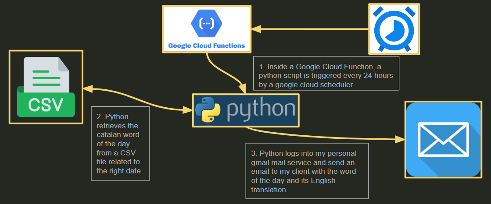

# Daily Catalan Word Emailer

This project is designed to email a daily word from a list of the 1000 most popular Catalan words, along with its meaning, to a specified recipient. The script automates the process of extracting a word from a CSV file and sending it via email.

## Table of Contents

1. [Overview](#overview)
2. [Features](#features)
3. [Infrastructure](#infrastructure)
4. [Getting Started](#getting-started)
5. [Usage](#usage)
6. [Contact](#contact)

## Overview

The main objective of this project is to automate the process of emailing a daily word from a CSV file containing Catalan words and their English meanings. The script reads the CSV file, selects the word for the current day, and sends it via email.

## Features

- Automated daily email with the word of the day and its meaning
- Reads data from a CSV file
- Uses Google Cloud Functions to run the script daily
- Sends email using Gmail SMTP

## Infrastructure

The following diagram provides an overview of the project's infrastructure:



1. **Google Cloud Functions**: A Python script runs every 24 hours.
2. **CSV Data Source**: The script reads words and meanings from a CSV file (`data_with_dates.csv`).
3. **Email Sending**: The script sends an email via Gmail SMTP.

## Getting Started

To get started with this project, follow these steps:

1. **Clone the repository**:
    ```sh
    git clone https://github.com/yourusername/daily-catalan-word-emailer.git
    ```

2. **Navigate to the project directory**:
    ```sh
    cd daily-catalan-word-emailer
    ```

3. **Install the required dependencies**:
    ```sh
    pip install -r requirements.txt
    ```

4. **Set up your environment variables** to connect to your Gmail account. Replace the placeholder values with your actual email credentials in the `main.py` file.

5. **Deploy the function to Google Cloud**:
    Follow the [Google Cloud Functions deployment guide](https://cloud.google.com/functions/docs/deploying) to deploy your function.

## Usage

Once set up, the script will automatically retrieve the word of the day from the CSV file and email it to the specified recipient every day.

To manually trigger the function, you can use the following command:
```sh
gcloud functions call hello_http --data '{}'
